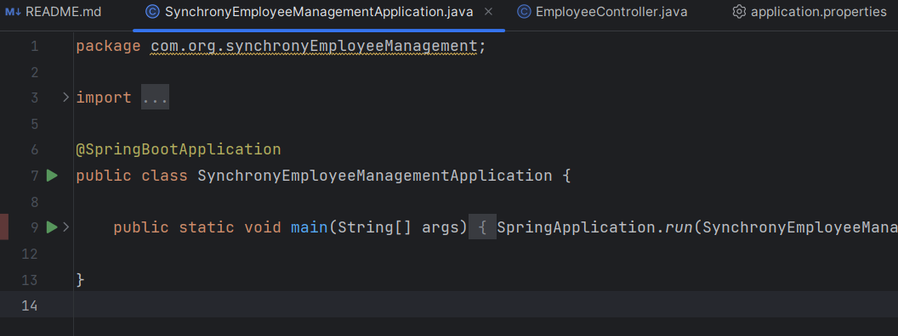
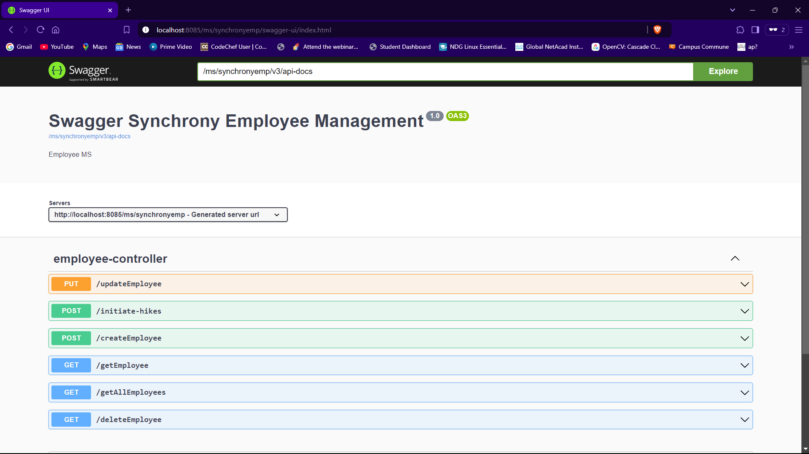
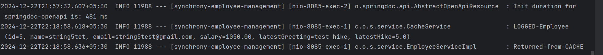
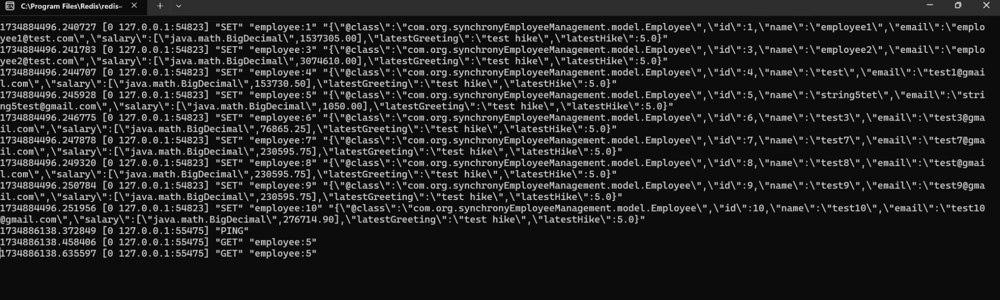

# Synchrony Employee Management Service

This service provides an employee management system that integrates with MySQL for data storage and Redis for caching frequently accessed data. It supports parallel processing of requests, ensuring high throughput and low latency for handling employee data and processing employee hikes asynchronously.

## Features

- **CRUD Operations**: Create, Read, Update, and Delete employee data with MySQL.
- **Redis Caching**: Cache frequently accessed employee data to reduce database load.
- **Parallel Threading**: Improve performance by processing data concurrently using Spring's `ExecutorService`.
- **Asynchronous Hike Processing**: Use asynchronous processing to calculate and apply salary hikes for employees in parallel.
- **Feature-1**: Covers `CRUD` operation with `cache`
- **Feature-2**: Covers `Executor, Async and Parallel threading`

## Tech Stack

- **Java 21** (or later)
- **Spring Boot 3.x**
- **MySQL** (Relational Database)
- **Redis** (Caching)
- **ExecutorService** for concurrency management

## Project Setup

### Prerequisites

1. **JDK 21**
2. **MySQL** installed locally or a MySQL server set up.
3. **Redis** installed locally or a Redis server set up.

### Installation

1. Clone the repository:

   ```bash
   git clone https://github.com/yourusername/synchrony-employee-management.git
   cd synchrony-employee-management

## Database Setup

### MySQL Setup

Before running the application, you need to set up the MySQL database and table structure.

1. **Create the Database:**

   First, log into your MySQL server and create the `synchrony` database.

   ```sql
   CREATE DATABASE synchrony;


---

## Application Configuration

The application requires configuration for MySQL and Redis connections. The following properties can be modified in the `application.properties` file located in the `src/main/resources` directory.

### MySQL Configuration

Make sure that your MySQL database is set up and running on your local machine or a remote server. The default settings assume the MySQL service is running on `localhost:3306`. If your setup differs (e.g., different port or credentials), you can update the following properties:

```properties
spring.application.name=synchrony-employee-management

# MySQL Configuration
spring.datasource.url=jdbc:mysql://localhost:3306/synchrony  # Change the database URL, port, and database name if necessary
spring.datasource.username=root  # Change the username as per your MySQL setup
spring.datasource.password=root  # Change the password as per your MySQL setup
spring.datasource.driver-class-name=com.mysql.cj.jdbc.Driver
spring.jpa.hibernate.ddl-auto=update

# Redis Configuration
spring.redis.host=localhost  # Modify the Redis host if running on a remote server
spring.redis.port=6379  # Modify the port if Redis is running on a non-default port
#spring.redis.password=  #Modify this if you are using password for your machine (Optional) 


# Thread Pool Configuration
thread.pool.size=10  # Adjust the size of the thread pool based on your system's capabilities

# Server Configuration
server.port=8085  # Change the server port if 8085 is already in use or you want to use a different port
server.servlet.context-path = /ms/synchronyemp
```
## Redis setup
Download URL :
https://github.com/microsoftarchive/redis/releases/tag/win-3.2.100

## Run the Application
Once you've configured these properties to match your environment, you can run the application with the following command:
```
./mvnw spring-boot:run
```
OR
you can run directly `SynchronyEmployeeManagementApplication.java` file


### API DOCUMENTATION AND TESTING:

- Test All API at **Swagger UI** after running the application.
- Provided a link to access Swagger UI(Use after running the App): [http://localhost:8085/ms/synchronyemp/swagger-ui/index.html](http://localhost:8085/ms/synchronyemp/swagger-ui/index.html).



### Additional References of testing the application
reterival from cache :


redis cli :



